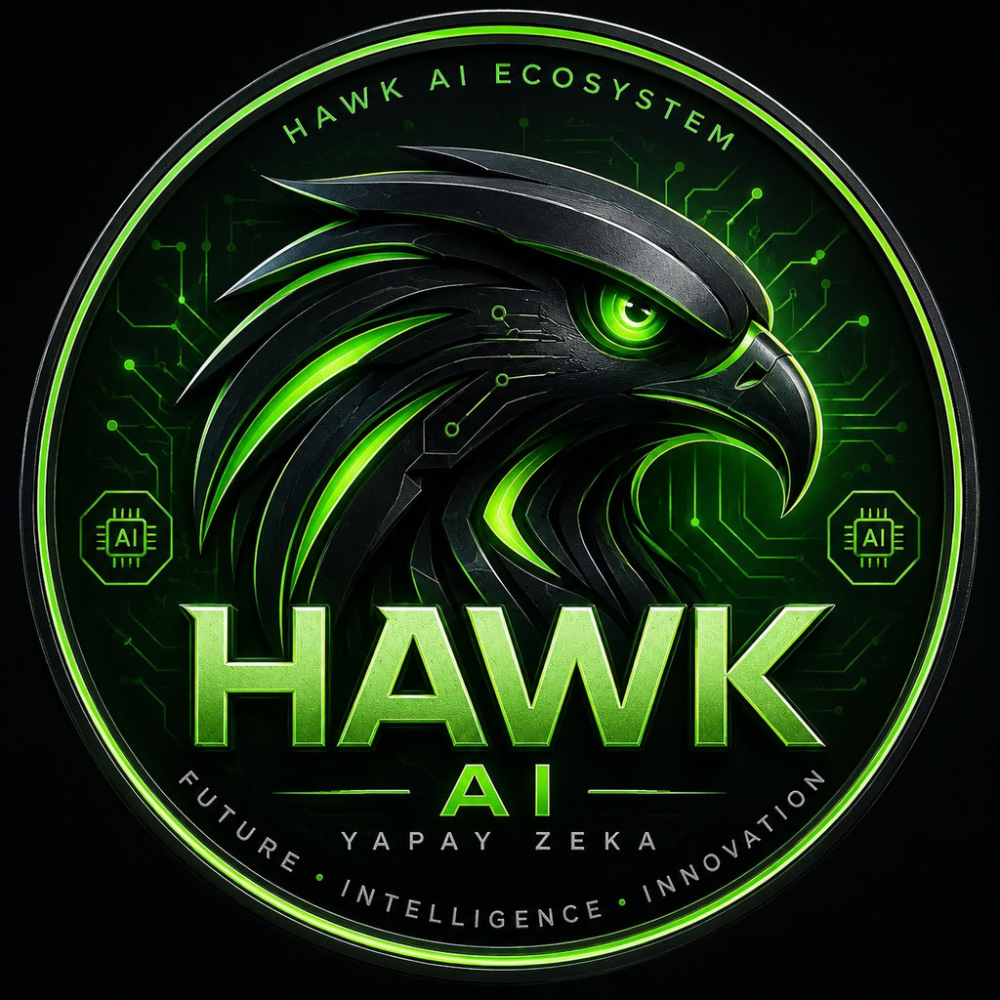

<div align="center">



# HAWK

### A personal AI operating system with its own fine-tuned model.

**HAWK is not a chatbot wrapper.** It runs on **HAWK Base** — our own model, fine-tuned and served on our infrastructure — wrapped in a real agent operating system: persistent memory, tool use, multi-agent orchestration, self-healing, and voice.

[](LICENSE)
[](MODEL_CARD.md)
[](MODEL_CARD.md)
[](eval/RESULTS.md)
[](#language)
[](#)
[](#status)

Created and owned by **Soner Aydoğan**.

</div>

---

> **For investors & partners:** HAWK owns its model, its training pipeline, its benchmark, and its agent OS — all in this repository. This is not a reseller of someone else's API; it is a real AI product with its own model serving real users today. Read the [Model Card](MODEL_CARD.md) and [benchmark results](eval/RESULTS.md).

---

## Why HAWK is a real AI, not a wrapper

Most "AI apps" are a thin UI over someone else's API. HAWK is different, and this repository is the proof:

- **Our own model — HAWK Base.** A model we fine-tune ourselves (see [`training/`](training/)) on an **open-source foundation model (Qwen3-8B, Apache-2.0)** using QLoRA. We own the training pipeline, the data, the versioning, and the deployment. HAWK Base serves **100% of normal conversations** on our own GPU.
- **A reproducible training pipeline** ([`training/train_hawk_base_lora.py`](training/train_hawk_base_lora.py)) — anyone can read exactly how HAWK Base is built.
- **An open benchmark** ([`eval/`](eval/)) — 73 deterministic tests (Turkish, English, multilingual, reasoning, code, tool-calling, memory, safety) with published scores per version. No cherry-picking.
- **A real agent OS**, not a prompt: Memory Engine, Reasoning Engine (Şahin Core), Agent Orchestrator, Tool Engine, Self-Healing.

> **On foundations:** HAWK Base is fine-tuned on an open-weight foundation model (Qwen3-8B, Apache-2.0). This is how every serious AI product is built — training an 8B model from scratch costs millions and adds no value. The engineering, data, alignment, and product are ours. We disclose our foundation openly; that transparency is a strength, not a weakness.

---

## Architecture

```
                        ┌──────────────────────────┐
   Voice / Text / File →│      HAWK Agent OS        │→ Answer / Action / Result
                        └────────────┬─────────────┘
              ┌──────────────┬───────┼────────┬──────────────┐
        Memory Engine   Şahin Core   Tool    Agent          Self-Healing
        (persistent)    (reasoning)  Engine  Orchestrator   (auto-recovery)
                              │
                        ┌─────┴─────┐
                        │ HAWK Base │  ← our own fine-tuned model
                        └───────────┘
```

| Component | What it does |
|---|---|
| **HAWK Base** | Our own fine-tuned model. Serves normal conversation, tool-calling, reasoning, code. |
| **Memory Engine** | Persistent, per-user memory. Remembers you, your goals, your projects across sessions. |
| **Şahin Core** | The reasoning engine — plans, decides which tools to use, orchestrates multi-step work. |
| **Tool Engine** | Web, files, images, device control — HAWK acts, not just talks. |
| **Agent Orchestrator** | Multiple specialized agents cooperating on complex goals. |
| **Self-Healing** | Watches its own health, recovers from failures automatically. |

See [`docs/ARCHITECTURE.md`](docs/ARCHITECTURE.md) for detail.

---

## HAWK Base — the model

| | |
|---|---|
| **Foundation** | Qwen3-8B (open-weight, Apache-2.0) |
| **Method** | QLoRA (4-bit nf4), prompt-masked SFT |
| **Languages** | Turkish, English, German, French, Spanish, Arabic, Russian |
| **Capabilities** | Natural conversation, tool-calling, reasoning, code, structured output, memory, safety |
| **Serving** | Our own GPU (on-demand + always-warm) |

Full details + benchmark scores: [`MODEL_CARD.md`](MODEL_CARD.md).

---

## Repository layout

```
hawk-core/
├── README.md              ← you are here
├── MODEL_CARD.md          ← HAWK Base: foundation, method, benchmark scores
├── CHANGELOG.md           ← version-by-version history of HAWK Base
├── docs/ARCHITECTURE.md   ← the agent OS in depth
├── src/                   ← real HAWK modules (safety, memory, model-ops, serving)
├── training/              ← the reproducible fine-tuning pipeline
│   ├── train_hawk_base_lora.py
│   ├── requirements.txt
│   └── data_sample.jsonl  ← sample of the SFT format
├── eval/                  ← the open benchmark (73 tests) + scorers
│   ├── run_bench.py · score.py · testset.jsonl
│   └── RESULTS.md         ← scores per version
├── CONTRIBUTING.md · SECURITY.md · CODE_OF_CONDUCT.md · CITATION.cff
└── LICENSE                ← Apache-2.0
```

---

## Status

HAWK is in active development toward global launch. HAWK Base is live and serving real users today.

**HAWK is built and owned by Soner Aydoğan.**

## License

Apache-2.0 — see [`LICENSE`](LICENSE).
