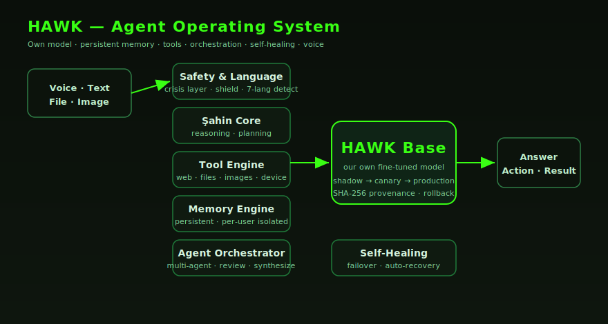

<div align="center">


# HAWK

### A personal AI operating system with its own fine-tuned model.

**HAWK is not a chatbot wrapper.** It runs on **HAWK Base** — our own model, fine-tuned and served on our infrastructure — wrapped in a real agent operating system: persistent memory, tool use, multi-agent orchestration, cost-aware routing, self-improvement, self-healing, and voice.

[](https://github.com/snraydogan86-ux/hawk-core/actions/workflows/ci.yml)
[](LICENSE)
[](MODEL_CARD.md)
[](MODEL_CARD.md)
[](eval/RESULTS.md)
[](#-multilingual)
[](core/)
[](#-status)

**Created and owned by Soner Aydoğan.**

</div>

---

> **For investors & partners:** HAWK owns its model, its training pipeline, its benchmark, and its agent OS — all in this repository. This is not a reseller of someone else's API; it is a real AI product with its own model serving real users today. Read the [Model Card](MODEL_CARD.md) and [benchmark results](eval/RESULTS.md).

---

## 🚀 Quickstart

```bash
# the deterministic safety layer — no setup, no GPU
python examples/safety_demo.py

# the open benchmark scorers
cd eval && python run_bench.py --self-test
```

See [`docs/GETTING_STARTED.md`](docs/GETTING_STARTED.md) · [`docs/USAGE.md`](docs/USAGE.md).

---

## 🌟 What HAWK is

HAWK is a personal and enterprise AI that helps you in daily life and work. It chats, analyzes images and documents, talks with you by voice, runs software tasks on your own computer, remembers you across sessions, and can act autonomously through its own tools — with privacy and safety first.

**More than a chatbot:** HAWK uses its own tools, learns, and can operate autonomously. And unlike a wrapper, **its brain is its own** — HAWK Base, a model we fine-tune and serve ourselves.

---

## ✨ Features

### 💬 Smart Chat (multilingual)
Natural conversation with fast, context-aware answers in **7 languages** (Turkish, English, German, French, Spanish, Arabic, Russian). Language is auto-detected from your message — HAWK replies natively, not translated. Conversation history persists; pick up where you left off.

### 🎙️ Voice
Real-time voice conversation — speak instead of type. HAWK transcribes (speech→text), understands, and replies by voice, with the same multilingual behavior as text.

### 🖼️ Vision & File analysis
Upload photos, PDF, Word, Excel, CSV or text — HAWK reads, explains, summarizes, and answers questions about the content.

### 🎨 Image generation & editing
Describe it and HAWK creates images, logos, and social posts — plus object removal, background change, and edits.

### 🧠 Persistent memory
HAWK remembers you, your goals, your projects and preferences — across sessions and across surfaces (chat, voice, workspace). Users are **strictly isolated**: one user can never see another's memory.

### 💻 Workspace (Phone → PC)
Connect your computer; HAWK writes code, creates files, runs commands and builds projects — driven from your phone, with an approval step at every risky action.

### 🛡️ Safety by design
A dedicated crisis / self-harm safety layer, prompt-injection shield, and strict handling of personal data — verified on every model version.

---

## 🧩 Capabilities

| Capability | Status |
|---|:--:|
| 💬 Chat (multilingual, 7 languages) | ✅ |
| 🎙️ Voice — speech + real-time conversation | ✅ |
| 🖼️ Vision — image analysis | ✅ |
| 📄 File analysis (PDF/DOCX/XLSX/CSV/TXT/image) | ✅ |
| 🧠 Persistent, per-user isolated memory | ✅ |
| 💻 Workspace — phone → PC, code & commands | ✅ |
| 🌐 Web intelligence — search + live data | ✅ |
| 🛠️ Tool-calling — the model calls real tools | ✅ |
| 🧮 Smart model router + 💰 cost guardian | ✅ |
| 🚦 Evidence-gated model promotion (ML-ops) | ✅ |
| 🎨 Image generation / editing | ✅ |
| 🤖 Multi-agent orchestration | ✅ |
| 🔁 Self-improvement loop | ✅ |

---

## 🧠 HAWK Base — the model

| | |
|---|---|
| **Foundation** | open-weight foundation model (Apache-2.0) |
| **Method** | QLoRA (4-bit nf4), prompt-masked SFT |
| **Languages** | Turkish, English, German, French, Spanish, Arabic, Russian |
| **Capabilities** | conversation, tool-calling, reasoning, code, structured output, memory, safety |
| **Serving** | our own GPU (on-demand + always-warm) |
| **Benchmark** | 64/73 and improving — see [RESULTS](eval/RESULTS.md) |

Full details: [`MODEL_CARD.md`](MODEL_CARD.md). Training pipeline: [`training/`](training/).

> **On foundations:** HAWK Base is fine-tuned on an open-weight foundation model. This is how every serious AI product is built — training a model from scratch costs millions and adds no value. The engineering, data, alignment, and product are ours. We disclose our foundation openly; that transparency is a strength.

---

## 🧮 Smart Model Router & Cost Economy

HAWK doesn't run the biggest model on every request. Each request is classified and routed to the right tier — this is what makes HAWK both **fast** and **cheap to operate**.

- **Router** — for each request it estimates intent, complexity, tokens, tool count, and whether deep reasoning is needed, then routes: simple → the lightest path, normal → **HAWK Base (our own model)**, hardest/comprehensive → the strongest available tier.
- **Escalation** — after a response, confidence is scored; low confidence escalates one tier (bounded).
- **AI Economy Manager** ([`core/economy_manager.py`](core/economy_manager.py)) — tracks daily/hourly spend, tokens, average cost, and requests against a daily budget, and tightens routing as the budget fills.
- **Cost Guardian** ([`core/cost_guard.py`](core/cost_guard.py)) — response/tool caches avoid re-doing the same expensive work, with granular kill-switches and a hard daily budget.

---

## 🚦 ML-Ops — how a model reaches users

HAWK ships models like a disciplined AI lab, not by hand. See [`ml_ops/`](ml_ops/).

```
draft → shadow → canary → production
```

- Every version is trained, **benchmarked on the same 73-test suite**, and checksummed (SHA-256 provenance).
- A version **cannot reach users** without passing benchmark + safety gates ([`promotion_controller.py`](ml_ops/promotion_controller.py)).
- **Automatic rollback** on regression (error rate / latency / safety).

This is the difference between "a prompt" and a real model operation.

---

## 🤖 Multi-agent orchestration

For complex goals, HAWK runs multiple specialized agents that decompose the problem, work in parallel, review each other, and synthesize a result — see [`orchestration/`](orchestration/).

## 🔁 Self-improvement

HAWK analyzes itself, generates tasks and plans, and defines sub-agents within safe bounds — it produces plans, drafts, and reports; it never executes critical actions automatically. Every critical action (deploy, migration, payment, publishing) is **human-approved**. See [`core/self_improvement_system.py`](core/self_improvement_system.py).

## 🌍 Multilingual

Language is auto-detected from each message and HAWK replies natively — Turkish, English, German, French, Spanish, Arabic, Russian — identically in text and voice.

---

## 🏗️ Architecture

<div align="center"></div>

| Component | What it does |
|---|---|
| **HAWK Base** | Our own fine-tuned model. Serves conversation, tool-calling, reasoning, code. |
| **Memory Engine** | Persistent, per-user memory, strictly isolated. |
| **Şahin Core** | The reasoning engine — plans and orchestrates multi-step work. |
| **Tool Engine** | Web, files, images, device control — HAWK acts, not just talks. |
| **Agent Orchestrator** | Specialized agents cooperating on complex goals. |
| **Self-Healing** | Watches its own health, recovers automatically. |

Deep dive: [`docs/ARCHITECTURE.md`](docs/ARCHITECTURE.md).

---

## 📁 Repository layout

```
hawk-core/
├── core/            HAWK's platform core — brain, conversation, memory, safety, learning, economy
├── ml_ops/          model version state machine + evidence-gated promotion (shadow→canary→prod)
├── orchestration/   multi-agent orchestration
├── serving/         HAWK Base adapter server
├── workspace/       device pairing, workspace, self-improvement
├── training/        reproducible QLoRA fine-tuning pipeline (+ requirements, data sample)
├── eval/            the open benchmark (73 tests) + scorers + RESULTS per version
├── examples/        runnable demos (safety layer, benchmark)
├── tests/           unit tests (CI-verified)
├── docs/            architecture, getting-started, usage, diagram
├── MODEL_CARD.md · CHANGELOG.md · ROADMAP.md · CONTRIBUTING · SECURITY · CITATION
└── LICENSE          Apache-2.0
```

---

## 📚 Documentation

- 📖 [Getting Started](docs/GETTING_STARTED.md) · [Usage](docs/USAGE.md) · [Architecture](docs/ARCHITECTURE.md)
- 🧠 [Model Card](MODEL_CARD.md) · 📊 [Benchmark Results](eval/RESULTS.md) · 📝 [Changelog](CHANGELOG.md) · 🗺️ [Roadmap](ROADMAP.md)
- 🤝 [Contributing](CONTRIBUTING.md) · 🔒 [Security](SECURITY.md) · [Code of Conduct](CODE_OF_CONDUCT.md)

---

## 🔮 Status

HAWK is in active development toward global launch. **HAWK Base is live and serving real users today.**

## 📄 License & ownership

**HAWK is built and owned by Soner Aydoğan** (© 2026). Distributed under the **Apache-2.0** license — see [`LICENSE`](LICENSE).

<div align="center">

**🦅 HAWK — Intelligent. Autonomous. Its own.**

</div>
